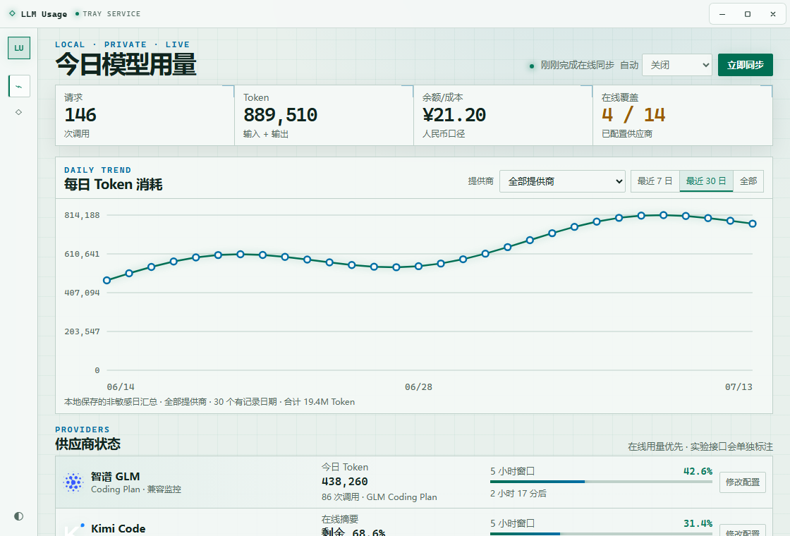
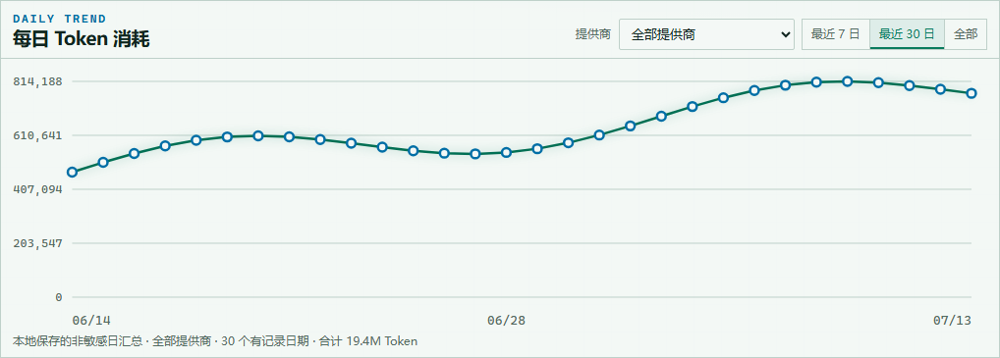
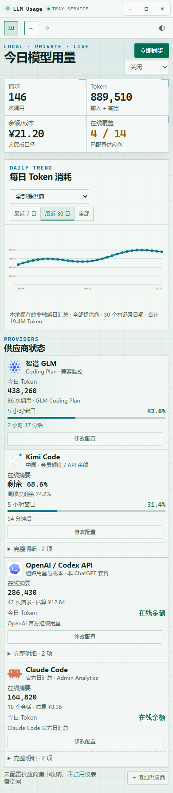

# LLM Usage

> Windows 优先的轻量 LLM 用量仪表盘：在一个窗口里查看多家模型 API 与 Coding Plan 的今日用量、每日趋势、套餐余量、余额、成本估算和冷却时间。




<p align="center"><sub>v0.1.1 桌面界面 · 截图使用演示数据，不包含真实账户或凭据信息</sub></p>

## v0.1.5 有什么新变化

v0.1.5 新增「今日资金消耗」：每个账号行内展示今日消耗金额，仪表盘顶部新增汇总磁贴。数据采用混合口径——OpenAI 与 Claude Code 使用官方成本接口的真实数据；其余人民币余额账号（DeepSeek、硅基流动、PPIO、Kimi 等）按余额变化估算，充值与赠款不计入、不会出现负数，估算值单独标注口径。删除账号后立即退出汇总，但历史趋势保持完整。本版本同时兼容 GLM 新版 `CREDIT_LIMIT` 与旧版 `TOKENS_LIMIT` 额度响应，并展示 5 小时、每周等全部可识别窗口。

> v0.1.4 支持同一供应商配置多个实例：在供应商目录中可为已配置的供应商继续「添加实例」（例如两个 GLM 或 Kimi 账号 Key），每个实例独立保存凭据、快照缓存与每日汇总，主列表各自成行并显示实例徽标，可分别测试连接、同步与删除。新增「删除供应商」功能：二次确认后清除本机保存的 API Key 与缓存摘要（不影响历史趋势）；同时修正 macOS 上钥匙串读取失败时的平台化错误提示。新增三家供应商：Anthropic API（官方 Messages 用量报告）、xAI / Grok（Management API 预付余额与今日消耗）、PPIO 派欧云（官方人民币余额）。

> v0.1.3 将用量历史采样细化到 15 分钟粒度，新增「今日」趋势视图；供应商改为并行同步；超过 30 天的明细自动按天汇总。

> v0.1.2 新增「关于」页面，集中展示应用版本、标识、技术栈与隐私安全说明，并修正了 GLM 等仅暴露重置时间点的供应商的剩余时间显示。

| 版本 | 能力 |
| --- | --- |
| v0.1.0 | 供应商在线用量、额度、余额、完整明细和凭据配置；尚未展示跨供应商汇总趋势 |
| v0.1.1 | 增加今日请求/Token/成本汇总、每日 Token 趋势、最近 7 日/30 日/全部范围、提供商筛选，以及系统托盘工作流 |
| v0.1.2 | 新增「关于」页面（版本、标识、技术栈、隐私与安全说明）；修正 GLM 等仅暴露重置时间点的供应商剩余时间显示 |
| v0.1.4 | 同一供应商多实例（独立凭据/快照/日汇总与实例徽标）；「删除供应商」功能；新增 Anthropic API、xAI / Grok、PPIO 派欧云三家供应商 |
| v0.1.3 | 用量历史采样细化到 15 分钟粒度，新增「今日」趋势视图；供应商并行同步；超过 30 天的明细自动按天汇总 |
| v0.1.5 | 今日资金消耗；兼容 GLM 新旧额度类型与多窗口响应 |

### 每日趋势



- 每次成功同步后，按“本地日期 + 15 分钟槽位 + 提供商”保存一条非敏感采样；同一天内不再互相覆盖。
- 支持今日（15 分钟粒度）、最近 7 日、最近 30 日和全部历史；超过 30 天的明细自动合并为每日一条。
- 可查看所有提供商合计，也可切换到单个提供商。
- 余额型供应商没有 Token 指标时不会被错误绘制成零消耗。
- 历史从首次使用 v0.1.1 成功同步之日开始积累，不猜测或伪造更早的数据。

### 响应式布局

<details>
<summary>查看移动端/窄窗口布局</summary>

<p align="center">
  
</p>

</details>

## 核心能力

- **跨供应商总览**：汇总今日请求数、Token、人民币成本估算和已配置供应商覆盖率。
- **今日资金消耗**：按账号展示今日官方成本或余额差分估算（充值与赠款不计入、不为负），顶部磁贴汇总求和。
- **多实例账号**：同一供应商可添加多个实例（例如两个 GLM 或 Kimi 账号 Key），各自独立保存凭据、快照与每日汇总，可分别测试连接并持续查看每个实例的 Token 用量。
- **每日消耗趋势**：原生 SVG 图表，不引入大型图表运行时，数据点支持键盘聚焦和辅助技术说明。
- **余额变化曲线**：按供应商或合计查看余额随时间的变化，余额为存量指标，每日取最晚同步快照，跨供应商求和时向前携带最后已知余额。
- **在线数据优先**：优先使用供应商官方用量、Analytics、Monitoring 或余额接口。
- **完整额度明细**：多模型、多窗口和多资源额度不会只保留第一项，明细默认折叠。
- **冷却与重置**：展示可验证的重置时间或剩余时长；没有可靠数据时明确标记未知。
- **供应商目录**：仪表盘只显示已配置项，未配置供应商集中放在添加目录中。
- **系统托盘**：关闭和最小化后隐藏到托盘，可从托盘显示窗口、立即同步或退出。
- **开机自启动**：侧栏 ⏻ 开关控制，默认关闭；开启后写入系统启动项（Windows 注册表 Run 键 / macOS LaunchAgent / Linux `.desktop`）。
- **轻量桌面壳**：Tauri 2 + 原生 TypeScript + Rust，不引入 React/Vue 与 Electron 运行时。

## 支持的供应商

| 供应商 | 区域 | 数据来源 | 展示内容 |
| --- | --- | --- | --- |
| 智谱 GLM | 中国 | 社区 API Key 监控端点 | 当日调用、Token、滚动 Token 窗口百分比、重置倒计时 |
| Kimi Code / Moonshot API | 中国 | Kimi Code 用量端点；Moonshot 官方余额兜底 | 全部额度窗口、周用量、并发/总量限制与重置时间；或人民币余额 |
| Kimi | 国际 | 官方余额接口 | 可用余额 |
| DeepSeek | 中国 | 官方余额接口 | 可用余额、充值余额、赠送余额 |
| MiniMax | 中国 | Token Plan 剩余额度接口，同区域主机兜底 | 所有模型和窗口的已用、剩余、总量、开始/重置时间与剩余时长 |
| MiniMax | 国际 | Token Plan 剩余额度接口 | 全部资源额度及时间信息 |
| 硅基流动 | 中国 | 官方用户信息接口 | 人民币余额、充值余额、免费余额 |
| SiliconFlow | 国际 | 官方用户信息接口 | 可用余额 |
| OpenRouter | 国际 | 官方 Credits 接口 | 已购额度减去用量后的美元余额 |
| OpenAI / Codex API | 国际 | Organization Usage 与 Costs API | 请求、输入/输出 Token、模型明细、美元成本及人民币估算 |
| Claude Code | 国际 | Claude Code Analytics API | UTC 日汇总会话、Token、模型成本和开发活动 |
| Anthropic API | 国际 | 官方 Messages 用量报告（Admin API） | 按模型的输入、缓存与输出 Token 日用量 |
| Gemini Code Assist | 国际 | Google Cloud Monitoring | API 调用数和已用 Token |
| Qwen / Model Studio | 中国 / 国际 | 官方私有 Prometheus 监控 | 各模型调用数和 Token 消耗 |
| xAI / Grok | 国际 | Management API 预付余额 | 美元预付余额、今日消耗与余额变动记录 |
| PPIO 派欧云 | 中国 | 官方余额接口 | 人民币可用余额、现金余额与信用额度 |

不同产品的统计能力并不相同，界面会标注数据来源与口径。完整能力矩阵见 [docs/PROVIDER_MATRIX.md](docs/PROVIDER_MATRIX.md)。

## 安装

### 下载 Windows 安装包

前往 [GitHub Releases](https://github.com/din4e/LLMUsage/releases) 下载最新的 x64 NSIS 安装包。

> 当前测试制品尚未进行商业代码签名，Windows SmartScreen 可能显示“未知发布者”。请核对 Release 页面提供的 SHA-256 后再运行。

### 从源码运行

需要 Node.js、Rust stable/nightly 工具链、Windows WebView2 与 Tauri 2 的系统依赖。

```powershell
git clone https://github.com/din4e/LLMUsage.git
cd LLMUsage
npm install
npm run tauri dev
```

### 构建 Windows 安装包

```powershell
npm test
cargo test --manifest-path src-tauri/Cargo.toml -j 1
npm run tauri build
```

安装包输出到：

```text
src-tauri/target/release/bundle/nsis/
```

## 凭据、隐私与数据边界

- API Key 按供应商隔离，并使用当前 Windows 用户的 DPAPI 加密。
- 不读取网页控制台、Cookie、浏览器存储、聊天内容、提示词、响应正文或其他应用的凭据。
- 不把 Authorization、原始 API 响应和账号身份对象写入快照或历史。
- 最新同步快照与每日趋势只保存非敏感汇总字段。
- 自动同步间隔保存在本地，仅属于非敏感 UI 设置。
- 所有外部供应商连接要求 HTTPS；应用不会要求网页登录 Cookie。

每日汇总采用有大小上限且经过字段校验的 JSON 文件。设计原因和未来 SQLite 迁移边界见 [ADR-001](docs/decisions/001-daily-usage-history-json.md)。

## 数据口径说明

- OpenAI 展示 API 组织数据，需要 Organization Admin API Key；不等同于个人 ChatGPT/Codex 订阅额度。
- Claude Code 需要 Anthropic Admin API Key；个人 Pro/Max 订阅没有公开的剩余额度 API。
- Anthropic API 与 Claude Code 使用同一类 Admin API Key，但口径不同：前者按模型统计 Messages API 的 Token 用量，后者是 Claude Code 的日汇总与开发活动；两者可分别配置。
- xAI 需要控制台生成的 Management Key 与团队 ID；推理用 API Key 无法查询预付余额。
- Gemini 需要 Google Cloud Project ID、Monitoring Viewer 权限和用户主动提供的 OAuth Access Token；应用不会读取 gcloud 或浏览器凭据。
- Qwen 使用高级监控的 Prometheus HTTP API 与最小权限 AccessKey；不使用 Coding Plan Key 自动查询。
- Kimi Code Key、Moonshot 开放平台 Key，以及 MiniMax 国内/国际 Key 属于不同产品或区域，会按密钥类型匹配端点。
- 「今日消耗」采用混合口径：OpenAI 与 Claude Code 使用官方成本接口的真实数据；其余人民币余额账号按余额变化估算（充值与赠款不计入、不为负），行内与汇总均标注口径。
- OpenAI 与 Claude 的美元成本仅在汇率可用时额外显示人民币估算。

## 技术架构

```text
供应商在线接口
      │
      ▼
Rust 适配器 ──→ DPAPI 凭据库
      │
      ├──→ 最新 snapshot JSON
      └──→ 每日非敏感汇总 JSON
                    │
                    ▼
         Tauri IPC + 原生 TypeScript UI
```

- **桌面壳**：Tauri 2 / WebView2
- **核心与安全边界**：Rust、`reqwest` + `rustls`、Windows DPAPI
- **前端**：原生 TypeScript、HTML、CSS、SVG
- **构建与测试**：Vite、Vitest、Cargo Test、NSIS
- **图标**：本地打包的 [Lobe Icons](https://github.com/lobehub/lobe-icons) SVG，安装后无需联网加载图标

## 开发命令

| 命令 | 作用 |
| --- | --- |
| `npm run dev` | 启动浏览器预览开发服务器 |
| `npm test` | 运行前端单元测试 |
| `npm run typecheck` | 运行 TypeScript 类型检查 |
| `npm run build` | 生成前端生产构建 |
| `cargo test --manifest-path src-tauri/Cargo.toml -j 1` | 运行 Rust 测试 |
| `npm run tauri dev` | 启动桌面开发应用 |
| `npm run tauri build` | 生成 Windows NSIS 安装包 |

## 分支约定

- `master`：可构建、可发布的稳定版本。
- `dev`：从 `master` 创建的日常开发分支；功能验证完成后再合入 `master`。

## 项目文档

- [产品规格](docs/SPEC.md)
- [供应商能力矩阵](docs/PROVIDER_MATRIX.md)
- [ADR-001：使用 JSON 保存每日用量汇总](docs/decisions/001-daily-usage-history-json.md)

## 当前限制

- Windows 是当前首要发布平台；macOS/Linux 仍需补齐系统凭据实现与打包验证。
- 趋势不会回填安装 v0.1.1 之前不存在的本地日汇总。
- 部分供应商只提供余额或套餐余量，没有公开 Token 历史接口。
- 项目不抓取网页控制台，也不支持个人 ChatGPT、Claude Pro/Max 等没有公开统计接口的订阅额度。
