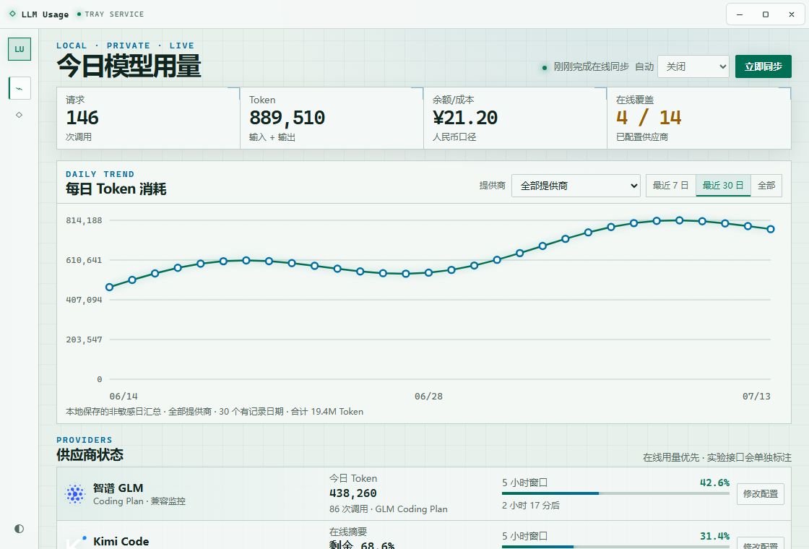
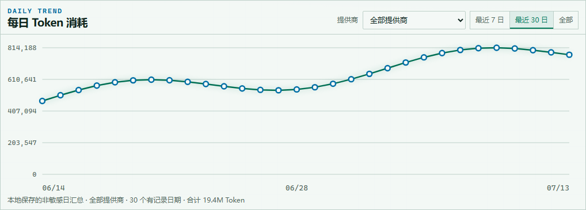
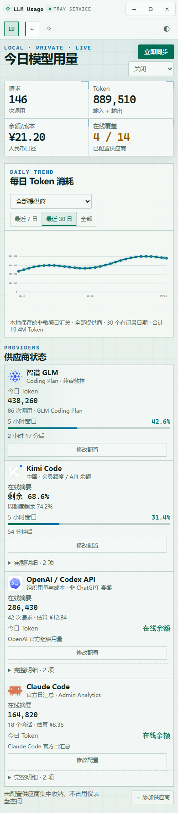
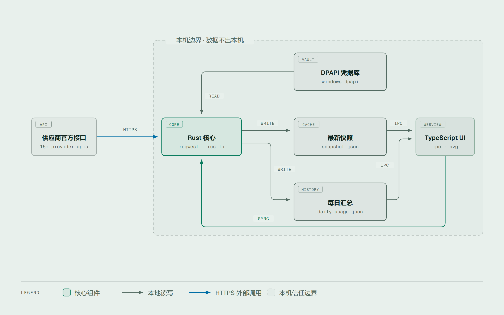

# LLM Usage

> Windows 优先的轻量 LLM 用量仪表盘：在一个窗口里查看多家模型 API 与 Coding Plan 的今日用量、每日趋势、套餐余量、余额、成本估算和冷却时间。
>
> 源码仓库：<https://github.com/din4e/LLMUsage>




<p align="center"><sub>桌面界面 · 截图使用演示数据，不包含真实账户或凭据信息</sub></p>

<details>
<summary>查看趋势与窄窗口界面</summary>



<p align="center">
  
</p>

</details>

## 功能特性

- **跨供应商总览**：今日请求数、Token、人民币成本估算与余额；同一供应商可添加多个实例，独立统计。
- **趋势图表**：每日消耗、余额变化与最近采样曲线，原生 SVG 绘制，不引入大型图表运行时。
- **在线数据优先**：直接请求供应商官方用量 / 余额接口，展示完整额度明细与重置时间。
- **完整备份迁移**：导出密钥、缓存摘要与整段用量历史，在新设备一键还原全部数据。
- **本地与私密**：凭据经系统加密存储，所有请求直连供应商官方接口，不经过任何第三方服务器。
- **桌面体验**：系统托盘、开机自启动、应用内在线更新。

## 支持的供应商

智谱 GLM、Kimi / Kimi Code、DeepSeek、MiniMax、硅基流动 / SiliconFlow、OpenRouter、OpenAI / Codex、Claude Code、Anthropic API、Gemini Code Assist、Qwen、xAI / Grok、PPIO 派欧云等 15+ 家。

各产品数据来源与统计口径见 [供应商能力矩阵](docs/PROVIDER_MATRIX.md)。

## 安装

### 下载安装包

前往 [GitHub Releases](https://github.com/din4e/LLMUsage/releases) 下载最新的 x64 NSIS 安装包。

> 制品未做商业代码签名，Windows SmartScreen 可能提示「未知发布者」，请核对 Release 页面提供的 SHA-256 后再运行。

### 从源码运行

需要 Node.js、Rust 工具链与 Windows WebView2。

```powershell
git clone https://github.com/din4e/LLMUsage.git
cd LLMUsage
npm install
npm run tauri dev
```

## 技术架构



<p align="center"><sub>WebView 界面触发 Rust 核心经 HTTPS 拉取供应商官方接口；凭据由 DPAPI 加密，快照与每日汇总仅存本机</sub></p>

- **桌面壳**：Tauri 2 / WebView2
- **核心与安全边界**：Rust、`reqwest` + `rustls`、Windows DPAPI
- **前端**：原生 TypeScript、HTML、CSS、SVG

## 隐私与数据边界

- API Key 按供应商隔离，使用当前 Windows 用户的 DPAPI 加密保存。
- 不读取网页控制台、Cookie、浏览器存储、聊天内容、提示词或响应正文。
- 快照与每日趋势只保存非敏感汇总字段；所有外部连接要求 HTTPS。
- 存储设计细节见 [ADR-001](docs/decisions/001-daily-usage-history-json.md)。

## 开发

| 命令 | 作用 |
| --- | --- |
| `npm run dev` | 启动浏览器预览开发服务器 |
| `npm test` / `npm run typecheck` | 前端单元测试 / 类型检查 |
| `cargo test --manifest-path src-tauri/Cargo.toml -j 1` | 运行 Rust 测试 |
| `npm run tauri dev` / `npm run tauri build` | 桌面开发 / 生成 NSIS 安装包 |

- 分支约定：`master` 为可构建、可发布的稳定版本；`dev` 为日常开发分支。
- 项目文档：[产品规格](docs/SPEC.md) · [供应商能力矩阵](docs/PROVIDER_MATRIX.md) · [ADR-001：使用 JSON 保存每日用量汇总](docs/decisions/001-daily-usage-history-json.md)

## 当前限制

- Windows 是首要发布平台；macOS / Linux 的系统凭据实现已补齐，但打包与真机验证仍待进行。
- 部分供应商只提供余额或套餐余量，没有公开的 Token 历史接口。
- 不支持个人 ChatGPT、Claude Pro/Max 等没有公开统计接口的订阅额度。
